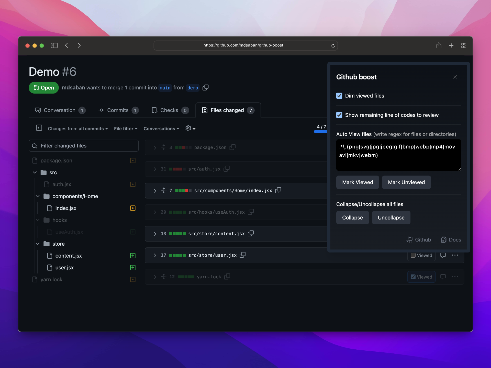

# Github Boost



[**Read Docs**](!https://mdsaban.com/packages/github-boost)

## Features

- **Dim Viewed Files:** Easily distinguish between reviewed and unreviewed files.
- **Show Remaining Lines of Code:** Keep track of how many lines of code are left to review
- **Auto View Files:** Automatically mark files as viewed based on customizable regex patterns for filenames or directories.
- **Collapse/Uncollapse All Files:** Quickly collapse or expand all files in the PR for better navigation.

# Setup on your local

1. Clone the Repository
2. Install Dependencies and run the project
   ```bash
   yarn install
   yarn dev
   ```
3. Open Chrome Extensions Page
   - Open Chrome and go to `chrome://extensions/`.
   - Enable Developer mode by toggling the switch in the top right corner.
   - Click on the Load unpacked button and select the `dist` folder from the cloned repository.
4. Verify Installation
   - Open a Github PR and you should see the extension icon in the top right corner of the browser.
   - Click on the icon to see the extension popup.

# Reference

Used [Chrome Extension Boilerplate](https://github.com/JohnBra/vite-web-extension).

# Contributing

Feel free to open PRs or raise issues!
